  

  
  
  
  
  
  

<h1 align="center">Massive upgrade</h1>

  A fork of <a href="https://github.com/LiveContainer/LiveContainer">LiveContainer</a> that keeps everything the original does 
  and fixes the four things that made a long app list painful to live with.

---

## What changed

LiveContainer's pitch is unlimited sideloaded apps in one app slot. Once you take it up on that, you end up with forty apps in a flat list, no backup, and a certificate that expires on a Tuesday without telling you. This fork is those four gaps closed, and nothing else touched.

| | Upstream | Plus |
|---|---|---|
| Organise apps | flat list, sort menu | **App groups**: create groups, filter chips at the top of the list, "Add to Group" in the long-press menu, membership pruned when an app is removed |
| Protect data | none | **Backup and restore**: one archive of every container and setting, restorable with a confirmation sheet, optional scheduled auto-backup on launch |
| Certificate | you notice when apps stop opening | **Certificate health**: days-left banner above the list, local notification before expiry, renewal as one visible operation |
| Add sources | one URL at a time | **Bulk sources**: paste a list, add all, refresh in parallel, export the list as JSON |

Everything is in `LiveContainerSwiftUI`, which Xcode 16+ picks up from the filesystem, so the upstream `project.pbxproj` is untouched and rebases stay clean. The full file-by-file list is in [CHANGELOG-FORK.md](./CHANGELOG-FORK.md); the reasoning behind each item, including why LiveContainer's real competitor is substitution rather than Sideloadly, is in [COMPETITIVE-ANALYSIS.md](./COMPETITIVE-ANALYSIS.md).

## Install

Builds come from GitHub Actions on `macos-latest` with Xcode 26.2. Every push to `main` produces both variants and publishes them to the `nightly` release.

| | Standalone | With SideStore built in |
|---|:-:|:-:|
| Nightly `.ipa` | [Download](https://github.com/SSH-PuR66/LiveContainer-Plus/releases/download/nightly/LiveContainer.ipa) | [Download](https://github.com/SSH-PuR66/LiveContainer-Plus/releases/download/nightly/LiveContainer+SideStore.ipa) |
| AltStore / SideStore source | [`apps_nightly.json`](https://github.com/SSH-PuR66/LiveContainer-Plus/releases/download/nightly/apps_nightly.json) | same source |

Sideload it the way you sideload anything else: SideStore, AltStore, Sideloadly, or a Windows machine and a cable with [filament](https://github.com/SSH-PuR66/filament). The `+SideStore` variant needs a signer that handles a framework nested inside a framework; zsign does not, rcodesign does, and filament's `rcsign.py` wraps that. Requirements are unchanged from upstream: iOS or iPadOS 15+, multitasking on 16+.

> The nightly IPAs are unsigned. If you install with a free Apple ID, extensions get stripped (each one would need its own app id), which turns off LiveProcess multitask mode and the share sheet. A paid developer account keeps them.

## Verified on a device

On 2026-09-03 both nightly artifacts were re-signed on Windows with a free-tier development identity and installed over stock LiveContainer 3.8.0 on an iPhone 17 running iOS 26.6. Both launched. The existing guest-app container survived the upgrade. The fork's own screens have been opened; end-to-end runs of backup/restore and certificate renewal on hardware are the next item, and the changelog says so rather than implying otherwise.

## Everything upstream still applies

This fork does not change how LiveContainer works, so the upstream material is the reference:

- Guides: [add to home screen](https://livecontainer.github.io/docs/guides/add-to-home-screen), [multiple LiveContainers](https://livecontainer.github.io/docs/guides/multiple-livecontainers), [multitasking](https://livecontainer.github.io/docs/guides/multitask), [JIT](https://livecontainer.github.io/docs/guides/jit-support), [tweaks](https://livecontainer.github.io/docs/guides/tweaks), [containers](https://livecontainer.github.io/docs/guides/containers-and-external-data), [hiding apps](https://livecontainer.github.io/docs/guides/lock-app)
- [FAQ](https://livecontainer.github.io/docs/faq) and the [compatibility list](https://github.com/LiveContainer/LiveContainer/labels/compatibility)
- How it works, from `__PAGEZERO` patching to the 128 keychain access groups: upstream [README](https://github.com/LiveContainer/LiveContainer#how-does-it-work)

Limitations are upstream's too: guest entitlements are not applied, permissions are global, guest containers are not sandboxed from each other, app extensions inside guests are unsupported, remote push does not work.

## Building

Open `LiveContainer.xcodeproj`, set `DEVELOPMENT_TEAM[config=Debug]` in `xcconfigs/Global.xcconfig` to your team, build. Or push to a fork of this repo and let the workflow do it.

## Support the work

If this saves you an afternoon, [a tip goes straight into the tooling](https://donate.stripe.com/28E9AVa46dUm7v570Ees00a): this fork, [filament](https://github.com/SSH-PuR66/filament), and whatever breaks next. Any amount, Stripe handles it, nothing recurring.

## Authorship and credit

The fork layer, the on-device verification, and the Windows signing path are by [Sergio Rodriguez](https://github.com/SSH-PuR66) ([sergrdz.pages.dev](https://sergrdz.pages.dev)).

LiveContainer itself is the work of [@khanhduytran0](https://github.com/khanhduytran0) and the [LiveContainer](https://github.com/LiveContainer/LiveContainer) contributors: @hugeBlack for the SwiftUI rewrite, @haxi0 and @m1337v for the icon, @Vishram1123, @Staubgeborener, @fkunn1326, @slds1, @StephenDev0, and everyone in the upstream credits. Techniques come from [xpn's dyld post](https://blog.xpnsec.com/restoring-dyld-memory-loading), [CFastFind](https://github.com/pinauten/PatchfinderUtils), [litehook](https://github.com/opa334/litehook), and [zsign](https://github.com/zhlynn/zsign) via [Feather](https://github.com/khcrysalis/Feather). Translations live in the upstream [Crowdin project](https://crowdin.com/project/livecontainer).

Upstream's warning stands here too: any build of LiveContainer has full access to every app inside it. Only install builds whose source you can read, which is why this one is public and built in the open.

## License

[Apache License 2.0](./LICENSE), same as upstream.
